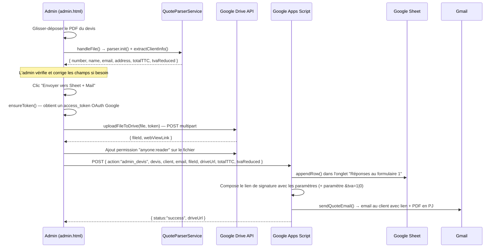
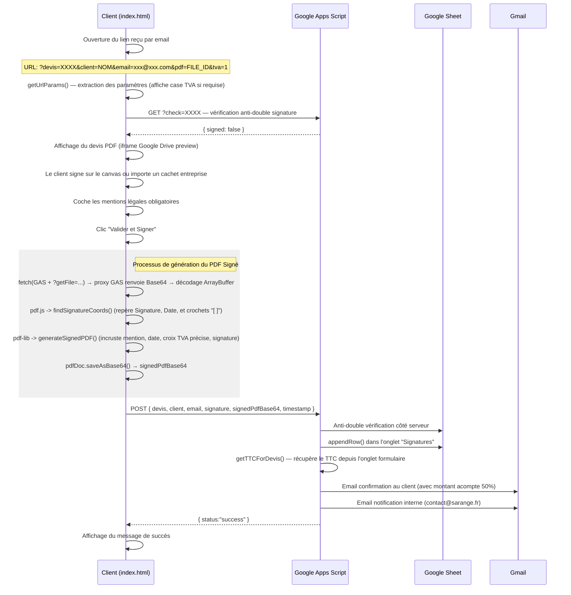

# ARCHITECTURE.MD — SignatureDevis (Sarange)

> **Version :** 1.1 — 23 février 2026  
> **Auteur :** Documentation technique auto-générée  
> **Audience :** Tout développeur rejoignant le projet

---

## 1. Vue d'ensemble

### Mission

**SignatureDevis** est un outil interne de **SARANGE** (fabricant de menuiseries sur mesure) permettant :

1. **Côté Admin** — D'extraire les informations d'un devis PDF (y compris la détection du taux de TVA réduit), de l'uploader sur Google Drive, d'enregistrer les métadonnées dans un Google Sheet, et d'envoyer un e-mail de signature au client.
2. **Côté Client** — De consulter son devis en ligne via une liseuse intégrée (iframe), de le télécharger, de le signer électroniquement via un pad tactile ou l'import d'un cachet d'entreprise, de cocher potentiellement une attestation de TVA réduite, et de recevoir une confirmation par e-mail.

### Stack technologique

| Couche         | Technologie                                                                                        |
| -------------- | -------------------------------------------------------------------------------------------------- |
| **Frontend**   | HTML5, CSS3 (vanilla + Tailwind CDN sur la page client), JavaScript vanilla (ES6+)                 |
| **PDF Gen/Mod**| [pdf-lib](https://pdf-lib.js.org/) v1.17.1 (chargé via CDN)                                        |
| **PDF Parse**  | [pdf.js](https://mozilla.github.io/pdf.js/) v3.11.174 (chargé dynamiquement via CDN)              |
| **Signature**  | [signature_pad](https://github.com/nicejslab/signature_pad) v4.2.0 (CDN)                          |
| **Proxy CORS** | Google Apps Script (téléchargement Base64 bypassant les blocages CORS et auth natifs)              |
| **Auth**       | Google Identity Services (GIS) — OAuth 2.0 Token Flow (scope `drive.file`)                         |
| **Backend**    | Google Apps Script (GAS) déployé en Web App                                                        |
| **Stockage**   | Google Sheets (base de données), Google Drive (PDFs), Gmail (emails transactionnels via `MailApp`) |
| **Hébergement**| Serveur HTTP statique (`http-server` en dev, `https://signature.sarange.fr` en production)       |

### Schéma d'architecture haut niveau

```
┌──────────────────────────────────────────────────────────────────┐
│                        NAVIGATEUR                                │
│                                                                  │
│  ┌─────────────────┐              ┌───────────────────────────┐  │
│  │   admin.html    │              │       index.html          │  │
│  │  (Outil interne)│              │   (Page client publique)  │  │
│  │                 │              │                           │  │
│  │  ┌────────────┐ │              │  ┌─────────────────────┐  │  │
│  │  │ admin.js   │ │              │  │      app.js         │  │  │
│  │  └─────┬──────┘ │              │  └──────────┬──────────┘  │  │
│  │        │        │              │             │             │  │
│  │  ┌─────┴──────┐ │              │             │             │  │
│  │  │QuoteParser │ │              │             │             │  │
│  │  │Service.js  │ │              │             │             │  │
│  │  └────────────┘ │              │             │             │  │
│  └────────┬────────┘              └─────────────┼─────────────┘  │
│           │                                     │                │
│     ┌─────┴──────┐                              │                │
│     │Google Drive │                              │                │
│     │ API (REST) │                              │                │
│     └─────┬──────┘                              │                │
└───────────┼──────────────────────────────────────┼────────────────┘
            │                                      │
            ▼                                      ▼
┌───────────────────────────────────────────────────────────────────┐
│              GOOGLE APPS SCRIPT  (gas-handler-admin.js)           │
│                                                                   │
│  doPost()                                                         │
│    ├─ action="admin_devis" → handleAdminDevis()                   │
│    │    ├─ Sheet.appendRow()     (Onglet "Réponses au formulaire")│
│    │    └─ sendQuoteEmail()      (Mail + lien de signature)       │
│    │                                                              │
│    └─ (signature)  → Sheet "Signatures".appendRow()               │
│                    → MailApp (confirmation client + notif interne)│
│                                                                   │
│  doGet()                                                          │
│    ├─ ?check=XXXX     → vérifie si devis déjà signé               │
│    └─ ?getFile=FILEID → télécharge et renvoie le PDF en Base64    │
└────────────┬──────────────────────────────────────────────────────┘
             │
             ▼
┌──────────────────────────────────┐
│         GOOGLE WORKSPACE         │
│                                  │
│  📊 Google Sheet                 │
│    ├─ Onglet "Réponses au        │
│    │  formulaire 1" (devis)      │
│    └─ Onglet "Signatures"        │
│                                  │
│  📁 Google Drive                 │
│    └─ Dossier partagé PDFs       │
│                                  │
│  ✉️  Gmail (MailApp)             │
│    ├─ Mail devis → client        │
│    ├─ Confirmation signature     │
│    └─ Notification interne       │
└──────────────────────────────────┘
```

---

## 2. Structure du projet

```
SignatureDevis/
│
├── index.html               ← Page client : consultation du devis + signature électronique
├── admin.html               ← Outil interne : extraction PDF → Drive + Sheet + Mail
├── brandsarange.html        ← Design System / Brand Board (référence charte graphique)
│
├── js/
│   ├── app.js               ← Logique de la page client (URL parsing, SignaturePad, envoi API)
│   └── admin.js             ← Logique admin (drag & drop, OAuth Google, upload Drive, envoi GAS)
│
├── QuoteParserService.js    ← Service d'extraction des données client depuis le texte brut PDF
│
├── gas-handler-admin.js     ← Code Google Apps Script (à copier dans l'éditeur GAS, PAS exécuté côté client)
│
├── css/
│   ├── style.css            ← Styles de la page client (charte Sarange, responsive mobile-first)
│   └── admin.css            ← Styles de la page admin (thème sombre, glassmorphism)
│
├── favicon-32.png           ← Favicon 32×32
├── favicon-192.png          ← Favicon 192×192 (PWA / Android)
├── apple-touch-icon.png     ← Icône iOS
│
└── .gitignore
```

### Rôle de chaque fichier

| Fichier                    | Rôle                                                                                                 |
| -------------------------- | ---------------------------------------------------------------------------------------------------- |
| `index.html`               | Page publique envoyée au client par e-mail. Affiche le devis PDF (iframe Google Drive) et le pad de signature. |
| `admin.html`               | Interface interne permettant de glisser-déposer un PDF de devis, d'en extraire les données (y compris la mention TVA), puis de les envoyer vers le système. |
| `brandsarange.html`        | Page de référence design (Brand Board) : logotypes, couleurs, typographie, composants UI. Non fonctionnelle, usage interne. |
| `js/app.js`                | Point d'entrée de la page client. Gère le parsing d'URL, l'anti-double signature, l'upload de cachet, le pad et l'envoi de la signature. |
| `js/admin.js`              | Point d'entrée de la page admin. Gère le drag & drop, l'OAuth Google, l'upload Drive et l'envoi vers GAS. |
| `QuoteParserService.js`    | Classe `QuoteParserService` : charge pdf.js dynamiquement, extrait N° devis, nom, email, adresse, total TTC et détection de TVA réduite. |
| `gas-handler-admin.js`     | **Code serveur** (Google Apps Script). Contient `doGet` (vérification signature / proxy PDF), `doPost`, `handleAdminDevis`, `sendQuoteEmail`, et les templates d'e-mails HTML. |
| `css/style.css`            | Variables CSS Sarange, composants signature (canvas, boutons, états succès/erreur), layout responsive 2 colonnes. |
| `css/admin.css`            | Variables CSS, thème sombre avec glassmorphism, dropzone animée, formulaire d'extraction, bannières. |

---

## 3. Flux de données (Data Flow)

### 3.1 — Flux Admin : Création et envoi du devis



**Détail des étapes :**

1. L'admin dépose un PDF dans la dropzone de `admin.html`.
2. `admin.js` invoque `QuoteParserService.init()` pour charger pdf.js, puis extrait le texte page par page.
3. `extractClientInfo()` utilise des regex pour trouver le N° de devis, le nom client, l'email, l'adresse, le total TTC, et la détection d'une mention TVA réduite.
4. Les champs (et le badge d'alerte TVA) sont affichés et éditables par l'admin.
5. Au clic sur "Envoyer", le PDF est uploadé directement sur Google Drive via l'API REST (pas via GAS).
6. Le fichier est rendu accessible en lecture à quiconque possède le lien.
7. Un POST est envoyé au GAS avec les métadonnées + l'ID du fichier Drive.
8. Le GAS écrit dans le Sheet, construit l'URL de la liseuse (avec ou sans le paramètre `tva=1`), et envoie l'e-mail de signature au client.

### 3.2 — Flux Client : Signature du devis



---

## 4. Composants principaux

### 4.1 — QuoteParserService (`QuoteParserService.js`)

Service de parsing de PDF côté navigateur localisé exclusivement au panel admin.

| Méthode                    | Rôle                                                                                      |
| -------------------------- | ----------------------------------------------------------------------------------------- |
| `init()`                   | Charge pdf.js via injection dynamique de `<script>` si non déjà chargé.                   |
| `_loadScript(url)`         | Helper : injecte un `<script>` dans le `<head>` et retourne une Promise.                  |
| `extractClientInfo(text)`  | Analyse le texte brut du PDF via regex et retourne `{ number, name, email, address, totalTTC, date, tvaReduced }`. |

**Stratégie d'extraction :**

```
Texte brut du PDF Sarange :
─────────────────────────────
  DA TRAVAUX                      ← Ligne 0 : Nom client
  59 RUE DE PONTHIEU              ← Lignes 1+ : Adresse
  75008 PARIS 08
  ...
  Devis N° 001804                 ← Regex : /Devis\s*N[°o.\s]*\s*0*(\d{4,6})/i
  ...
  Mail client : xxx@xxx.com       ← Regex : /Mail\s+client\s*:\s*(email)/i
  ...
  MONTANT TOTAL T.T.C. 35 207,10  ← Regex : /MONTANT\s+TOTAL\s+T\.?T\.?C\.?\s*(montant)/i
  Mention obligatoire à cocher... ← Regex de détection du mot-clé de TVA pour marquer la facturation réduite.
```

### 4.2 — Page Client — app.js (`js/app.js`)

Point d'entrée : `DOMContentLoaded → initPage()`

| Fonction              | Rôle                                                                                         |
| --------------------- | -------------------------------------------------------------------------------------------- |
| `getUrlParams()`      | Extrait `devis`, `client`, `email`, `pdf`, `tva` depuis `window.location.search`.                    |
| `checkAlreadySigned()` | Appel GET vers le GAS pour vérifier si le devis est déjà signé.                              |
| `initSignaturePad()`  | Initialise `SignaturePad` avec gestion du `devicePixelRatio` pour rendu Retina.               |
| `resizeCanvas()`      | Gère le redimensionnement responsif du canvas (efface le contenu).                            |
| `updateSubmitButton()` | Active le bouton uniquement si la(les) case(s) est/sont cochée(s) ET le canvas (ou cachet) non vide.                     |
| `generateSignedPDF()` | Orchestre le téléchargement via proxy, la modification (pdf-lib) et la sérialisation du PDF. |
| `findSignatureCoords()` | Analyse mathématique du PDF (pdf.js) pour trouver les coordonnées visuelles de "Signature du client :", "Le :" et des crochets TVA temporels `[  ]`.    |
| `handleSubmit()`        | Gère le clic : génération du PDF signed, puis envoi du payload complet au GAS.      |
| `showSuccess()`         | Masque le formulaire, affiche le message de confirmation.                           |
| `showAlreadySigned()`   | Affiche le bloc "déjà signé" si le devis a déjà été signé.                          |

**Machine à états de la page :**

```text
                 ┌──────────────┐
                 │  URL invalide │──── Pas de params → error-zone
                 └──────────────┘
                        │
                   params OK (tva révélée si tva=1)
                        │
                 ┌──────▼──────┐
                 │ Check signé │──── GET ?check=XXXX
                 └──────┬──────┘
                   │         │
               signé      pas signé
                   │         │
          ┌────────▼──┐  ┌───▼──────────┐
          │ Déjà signé│  │  Formulaire  │
          └───────────┘  │  Signature   │
                         └──────┬───────┘
                                │
                          ┌─────▼─────┐
                          │  Envoi OK │── success-zone
                          └───────────┘
```

### 4.3 — Page Admin — admin.js (`js/admin.js`)

Point d'entrée : `DOMContentLoaded → cacheDom() + initDropzone() + initGoogleAuth()`

| Fonction              | Rôle                                                                                         |
| --------------------- | -------------------------------------------------------------------------------------------- |
| `initGoogleAuth()`    | Initialise le token client GIS OAuth 2.0 (scope `drive.file`).                                |
| `ensureToken()`       | Renvoie une Promise résolue avec le token courant ou déclenche un popup OAuth.                |
| `uploadFileToDrive()` | Upload multipart du PDF vers Google Drive + ajout de permission publique en lecture.           |
| `initDropzone()`      | Gestion drag & drop + input file.                                                             |
| `handleFile()`        | Lecture du PDF via pdf.js, extraction du texte, appel à `extractClientInfo()`.                |
| `handleSend()`        | Orchestrateur principal : token → upload Drive → POST vers GAS → affichage résultat.         |
| `updateSendButton()`  | Validation dynamique : actif sous condition des 3 champs (devis, client, email). |

### 4.4 — Backend GAS (`gas-handler-admin.js`)

> ⚠️ Ce fichier est une **copie de référence**. Le code s'exécute dans l'environnement Google Apps Script, pas dans le navigateur.

| Fonction               | Déclencheur         | Rôle                                                                          |
| ---------------------- | -------------------- | ----------------------------------------------------------------------------- |
| `doGet(e)`             | HTTP GET             | Proxy : route vers `?check=XXXX` (signature) et `?getFile=ID` (PDF Drive CORS). |
| `doPost(e)`            | HTTP POST            | Routeur : dispatch vers `handleAdminDevis()` ou le handler de signature.      |
| `handleAdminDevis()`   | `action=admin_devis` | Écrit dans le Sheet + envoie l'email de signature au client (avec lien).      |
| `sendQuoteEmail()`     | interne              | Compose et envoie l'email HTML avec le lien de signature + PDF en PJ.         |
| `getTTCForDevis()`     | interne              | Retrouve le montant TTC d'un devis dans l'onglet formulaire.                  |
| `onFormSubmit(e)`      | Trigger Sheets       | Handler hérité (envoi via Google Forms — potentiellement obsolète).            |

---

## 5. Interactions API / Base de données

### 5.1 — Points de terminaison (endpoints)

| Méthode | URL                                        | Payload / Params                                        | Réponse                                     |
| ------- | -------------------------------------------- | ------------------------------------------------------- | ------------------------------------------- |
| `GET`   | `GAS_URL?check={devisNumber}`                | N° de devis en query string                             | `{ signed: true/false }`                    |
| `GET`   | `GAS_URL?getFile={fileId}`                   | ID Google Drive en query string                         | `{ status: "success", base64: "..." }`      |
| `POST`  | `GAS_URL` (signature)                        | `{ devis, client, email, signature, timestamp }`        | `{ status: "success" }` ou `{ status: "error", message: "already_signed" }` |
| `POST`  | `GAS_URL` (admin)                            | `{ action: "admin_devis", devis, client, ..., tvaReduced... }` | `{ status: "success/partial", driveUrl }` |
| `POST`  | Google Drive REST API v3 (upload multipart)  | FormData (metadata JSON + file blob)                    | `{ id, webViewLink }`                       |
| `POST`  | Google Drive REST API v3 (permissions)       | `{ role: "reader", type: "anyone" }`                    | Permission créée                            |

### 5.2 — Schéma Google Sheets

#### Onglet `Réponses au formulaire 1` (devis envoyés)

| Colonne A     | Colonne B  | Colonne C    | Colonne D | Colonne E   | Colonne F  | Colonne G   |
| ------------- | ---------- | ------------ | --------- | ----------- | ---------- | ----------- |
| Horodateur    | N° Devis   | Nom client   | Email     | Lien Drive  | Total TTC  | TVA Réd.    |

#### Onglet `Signatures` (signatures reçues)

| Colonne A    | Colonne B | Colonne C | Colonne D | Colonne E         | Colonne F        |
| ------------ | --------- | --------- | --------- | ------------------ | ---------------- |
| Date/Heure   | N° Devis  | Client    | Email     | Signature (Base64) | Timestamp Client |

### 5.3 — Google Drive

- **Dossier cible :** ID `1Tslss...Nur6kjnEr8zJlC5nc8vSz-wZoBML0jb`
- **Permissions :** Chaque fichier uploadé reçoit la permission `anyone:reader` pour permettre l'accès via le lien de signature.
- **Accès PDF :** Via le proxy GAS (`?getFile`) pour le composant Web, et via une iframe directe Google Drive pour la prévisualisation visuelle.

---

## 6. Gestion d'état et sécurité

### 6.1 — Gestion d'état

L'application est **stateless côté client** — aucun framework de state management n'est utilisé. L'état est géré de manière impérative :

| État                  | Stockage                                                          |
| --------------------- | ----------------------------------------------------------------- |
| Paramètres du devis   | URL query params (`?devis=...&client=...&email=...&pdf=...&tva=1`) |
| Token OAuth Google    | Variable globale `googleAccessToken` (mémoire, non persisté)      |
| Fichier PDF sélectionné | Variable globale `currentFile` (mémoire, non persisté)          |
| Statut de signature   | Vérifié en temps réel via GET au GAS à chaque chargement de page  |
| Contenu de la signature | Canvas local (image base64 à l'envoi, jamais persisté côté client) |

### 6.2 — Sécurité

#### Protection anti-double signature

- **Côté client** : Un appel `GET ?check=XXXX` est effectué au chargement de la page. Si le devis est déjà dans l'onglet "Signatures", le formulaire est masqué.
- **Côté serveur** : Le `doPost` vérifie à nouveau la liste des signatures avant d'insérer une nouvelle ligne, ce qui empêche les soumissions concurrentes.

#### Authentification

| Contexte         | Mécanisme                                                                                  |
| ---------------- | ------------------------------------------------------------------------------------------ |
| Page admin       | Google OAuth 2.0 via GIS (popup consent) — scope `drive.file` uniquement.                  |
| Page client      | **Aucune authentification** — l'accès est protégé uniquement par l'obscurité du lien (les paramètres de l'URL constituent le "secret"). |
| Google Apps Script | Déployé en mode « Exécuter en tant que moi, accessible à tous ».                         |

#### Transport des données sensibles

| Donnée              | Protection                                                                 |
| -------------------- | -------------------------------------------------------------------------- |
| Signature (base64)  | Transmise en HTTPS vers le GAS, stockée dans le Google Sheet.              |
| Email client         | Transmis en clair dans l'URL (query param) — visible dans les logs serveur. |
| Token OAuth          | Stocké en mémoire uniquement, expire automatiquement (1h par défaut).      |
| Client ID OAuth      | Exposé dans le code source (c'est normal pour un client ID public).        |
| Clé API GAS          | L'URL du webhook GAS est publique dans le code source.                     |

#### 6.3 — CORS et requêtes cross-origin

- **Google Apps Script** : Les requêtes vers GAS utilisent `Content-Type: text/plain;charset=utf-8` pour **éviter les preflight CORS** (requêtes OPTIONS).
- **Proxy PDF** : Télécharger un fichier directement via le webhook Google Drive cause des blocages CORS ou de session Google Workspace sur mobile. Notre proxy intégré dans `GAS: doGet(?getFile=)` télécharge le fichier natif grâce via `DriveApp` en backend, puis le convertit en Base64 et le passe au frontend. Le frontend décode le Base64 en `ArrayBuffer` sans aucun heurt CORS.

---

## 7. Emails transactionnels

Le système envoie **3 types d'e-mails** HTML depuis le GAS via `MailApp.sendEmail()` :

| Email                        | Destinataire         | Déclencheur                | Contenu                                                          |
| ---------------------------- | -------------------- | -------------------------- | ---------------------------------------------------------------- |
| **Devis à signer**           | Client               | Admin envoie le devis      | Lien de signature + PDF joint + coordonnées bancaires (IBAN/BIC) |
| **Confirmation de signature** | Client               | Le client signe            | Confirmation + devis visuellement signé (X TVA, Date, Cachet) + montant acompte (50% TTC) + RIB |
| **Notification interne**     | `contact@sarange.fr` | Le client signe            | Récapitulatif client/devis + lien vers le Google Sheet           |

> Tous les e-mails utilisent des templates HTML inline (pas de fichiers externes) avec la charte graphique Sarange (couleurs `#0F172A`, `#F97316`, police inter).

---

## 8. Points d'attention et dette technique

### 🔴 Critiques

| Point                                  | Détail                                                                                                                           |
| -------------------------------------- | -------------------------------------------------------------------------------------------------------------------------------- |
| **Sécurité du lien de signature**      | Le lien client ne comporte aucun token expiré ou haché. Quiconque possède l'URL peut signer. |
| **Email en clair dans l'URL**          | L'adresse email du client transit dans les query params.       |
| **Signature base64 en Google Sheet**   | Les images base64 et PDFs encodés pèsent dans le Sheet, ce qui impacte les performances à très grande échelle. |

### 🟡 Importants

| Point                                  | Détail                                                                                                                           |
| -------------------------------------- | -------------------------------------------------------------------------------------------------------------------------------- |
| **Algorithme d'alignement PDF JS**     | La position du X dans le PDF (case TVA et Date) a été millimétrée empiriquement.  Un changement radical du layout générateur du PDF pourrait forcer une ré-évaluation numérique de l'offset (`mentionX` et `mentionY`). |
| **`onFormSubmit`** | Historique "Google Forms" pouvant être retiré en toute pureté. |
| **Pas d'environnement de staging**     | Les IDs Google (Sheet, Drive folder, Client ID) sont en dur dans le code. Pas de distinction dev/prod.                            |

### 🟢 Améliorations souhaitables

| Point                                  | Détail                                                                                                                           |
| -------------------------------------- | -------------------------------------------------------------------------------------------------------------------------------- |
| **Variables d'environnement**          | Extraire les constantes (GOOGLE_CLIENT_ID, DRIVE_FOLDER_ID, API_URL) dans un fichier de config séparé.                            |
| **Bundler / Build step**               | Le projet n'a pas de build process. Un bundler (Vite, esbuild) permettrait le tree-shaking, le minification et les modules ES.    |

---

## 9. Guide de déploiement rapide

### Développement local

```bash
# Servir les fichiers statiques (déjà en cours sur le poste)
npx -y http-server . -p 8080 --cors -c-1
```

Puis ouvrir :

- **Page Admin :** `http://127.0.0.1:8080/admin.html`
- **Page Client (test) :** `http://127.0.0.1:8080/?devis=001804&client=DA%20TRAVAUX&email=test@example.com`

### Déploiement du GAS

1. Ouvrir [script.google.com](https://script.google.com) lié au Google Sheet cible.
2. Remplacer le contenu de `Code.gs` par le contenu de `gas-handler-admin.js`.
3. **Déployer → Gérer les déploiements → ✏️ Modifier → Nouvelle version → Publier.**
4. Mettre à jour les constantes `API_URL` et `ADMIN_API_URL` dans le code frontend si l'URL change.

### Configuration Google Cloud (OAuth)

- **Console :** [console.cloud.google.com](https://console.cloud.google.com)
- **Client ID type :** Application Web
- **Origines autorisées :** `http://127.0.0.1:8080` (dev), `https://signature.sarange.fr` (prod)
- **Scope :** `https://www.googleapis.com/auth/drive.file`
